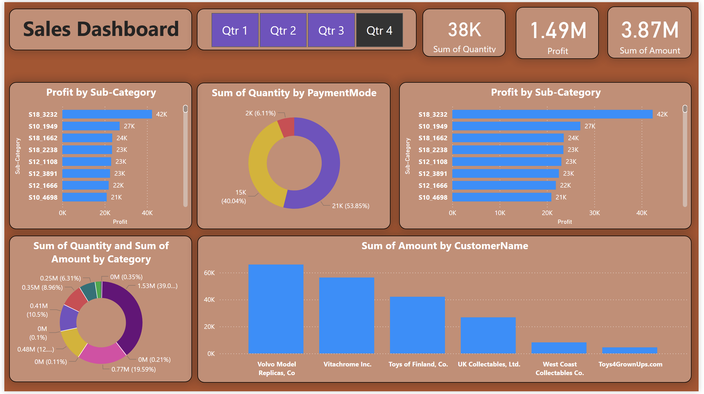

## Sales Performance Dashboard

---

### Business Problem
The objective of this project was to analyze Q4 sales performance to identify key revenue drivers and customer behavior. The business needed to understand which sub-categories yield the highest profit, determine the preferred payment methods used by customers, and identify top-tier clients to optimize year-end sales strategies and resource allocation.

### Dataset Explanation
This dashboard visualizes retail sales data specifically filtered for **Q4**. The data includes:
* **Product Data:** Performance metrics for various sub-categories and broader categories.
* **Customer Data:** Sales amounts attributed to specific corporate and individual clients.
* **Transaction Data:** Payment modes used (identified by percentage distribution) and total unit quantities sold.
* **Financial Metrics:** Total profit, gross amount, and total quantity across the final quarter.

### Key KPIs
* **Sum of Quantity:** 38K
* **Total Profit:** 1.49M
* **Sum of Amount:** 3.87M

### Insights
* **High-Profit Sub-Categories:** Sub-category **S18_3232** is the top profit performer, generating **42K**, followed by S10_1949 (27K). This indicates a strong market demand for these specific product lines.
* **Payment Method Dominance:** One primary payment mode accounts for **53.85% (21K)** of all transactions, while a secondary method accounts for 40.04%. A very small fraction (6.11%) uses a third method.
* **Top Revenue-Generating Customers:** **Volvo Model Replicas, Co** and **Vitachrome Inc.** are the leading customers by volume, significantly outspending other major clients like Toys of Finland, Co.
* **Category Contribution:** The largest product category accounts for **39.0% (1.53M)** of the total amount, while the top three categories combined represent the vast majority of the company's Q4 revenue.

### Business Recommendations
* **Focus on High-Margin Products:** Increase the marketing budget and inventory for top-performing sub-categories like **S18_3232** to maximize profit margins during peak seasonal demand.
* **Strategic Client Management:** Develop personalized "VIP" loyalty programs for top clients such as **Volvo Model Replicas, Co** to ensure retention and encourage higher spending in the following fiscal year.
* **Payment Method Optimization:** Since over 50% of customers prefer a specific payment mode, ensure the checkout process for that method is as streamlined as possible to prevent cart abandonment.
* **Re-evaluate Low-Impact Categories:** Investigate the categories contributing **0.35% or less** to the total amount to determine if they should be discontinued or bundled with more popular items to clear inventory.

Profit Margin % :=
DIVIDE ( [Profit], [Total Sales] )
```


# Power BI Sales Dashboard (DAX Modeling)

## Overview
This project demonstrates how to transform and model sales data using **DAX calculated tables and measures** in Power BI.  
A star schema was created from the raw CSV data, and key measures like Profit and Profit Margin were defined to enable dynamic, filter-aware analysis.

---

## Data Source
The dataset is sourced from Kaggle:

[Sample Sales Data](https://www.kaggle.com/datasets/kyanyoga/sample-sales-data)

- Downloaded as CSV
- Loaded into Power BI for analysis and modeling

---

## Data Preparation
After loading the data into Power BI, the flat dataset was normalized into two tables using **DAX calculated tables**:

1. **Orders** – header table containing unique orders
2. **Details** – fact table containing order line items

This structure follows a **star schema**, enabling efficient aggregation and dynamic measures.

---

## Orders Table (DAX Calculated Table)

```DAX
Orders =
VAR BaseTable =
    SELECTCOLUMNS (
        sales_data_sample,
        "Order ID", sales_data_sample[ORDERNUMBER],
        "Order Date", DATEVALUE ( sales_data_sample[ORDERDATE] ),
        "CustomerName", sales_data_sample[CUSTOMERNAME],
        "State", sales_data_sample[STATE],
        "City", sales_data_sample[CITY]
    )
RETURN
    DISTINCT ( BaseTable )
```

## Details Table (DAX Calculated Table)
```DAX
Details =
SELECTCOLUMNS (
    sales_data_sample,
    "Order ID", sales_data_sample[ORDERNUMBER],
    "Amount", sales_data_sample[SALES],
    "Quantity", sales_data_sample[QUANTITYORDERED],
    "Category", sales_data_sample[PRODUCTLINE],
    "Sub-Category", sales_data_sample[PRODUCTCODE],
    "PaymentMode", sales_data_sample[DEALSIZE]
)
```
## Profit (DAX Calculated Measure)
```DAX
Profit :=
SUMX (
    Details,
    VAR Margin =
        0.20
            + ( 0.60 - 0.20 )
                * DIVIDE ( MOD ( Details[Order ID], 100 ), 100 )
    RETURN
        Details[Amount] * Margin
)
```
