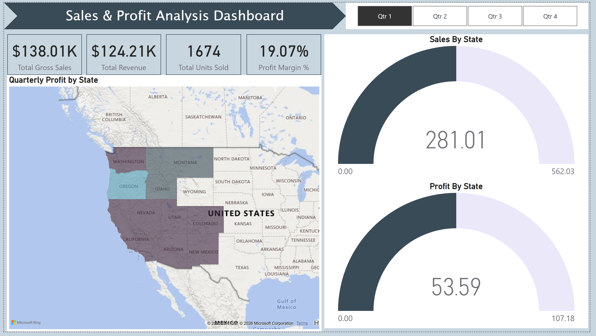

## Sales & Profit Analysis Dashboard

---

### Business Problem
The objective of this project was to analyze Q1 financial performance to identify growth opportunities and efficiency gaps. The business needed to understand the relationship between Gross Sales and actual Revenue, while identifying which product categories and geographic regions were underperforming or operating at a loss.

### Dataset Explanation
https://www.kaggle.com/datasets/anandshaw2001/amazon-sales-dataset
The analysis is based on a retail sales dataset filtered for the **Q1** period. The data includes:
* **Financials:** Gross sales, net revenue, and calculated profit margins.
* **Product Categories:** Sub-category data (e.g., Copiers, Binders, Accessories).
* **Geography:** Performance metrics segmented by U.S. States.
* **Volume:** Unit counts per product line.

### Key KPIs
* **Total Gross Sales:** $138.01K
* **Total Revenue:** $124.21K
* **Total Units Sold:** 1,674
* **Profit Margin %:** 19.07%

### Insights
* **Top Profit Driver:** **Copiers** are the primary profit contributor, significantly outperforming all other categories despite not having the highest unit volume.
* **Negative Margin States:** While **Idaho** leads in profitability, **Arizona** and **Colorado** are currently showing negative profit margins (operating at a loss).
* **High Volume, Low Margin:** Categories like **Binders** and **Paper** occupy the largest share of sales volume (as seen in the Treemap) but contribute moderately to the total profit compared to high-value tech items.
* **Revenue Gap:** There is a ~$14K difference between Gross Sales and Revenue, indicating the impact of discounts, returns, or operational costs.

### Business Recommendations
* **Regional Course Correction:** Investigate the cost of goods sold (COGS) and logistics in **Arizona** and **Colorado** to flip negative margins into positive ones.
* **Inventory Prioritization:** Increase marketing and stock levels for **Copiers** and **Storage** units, as these items show the highest profit efficiency.
* **Discount Optimization:** Review the discounting strategy for high-volume items like **Binders** to reduce the "leakage" between Gross Sales and final Revenue.
* **Portfolio Review:** Evaluate the bottom-tier categories (e.g., **Fasteners**, **Supplies**) to determine if they should be bundled or discontinued to save on overhead.
