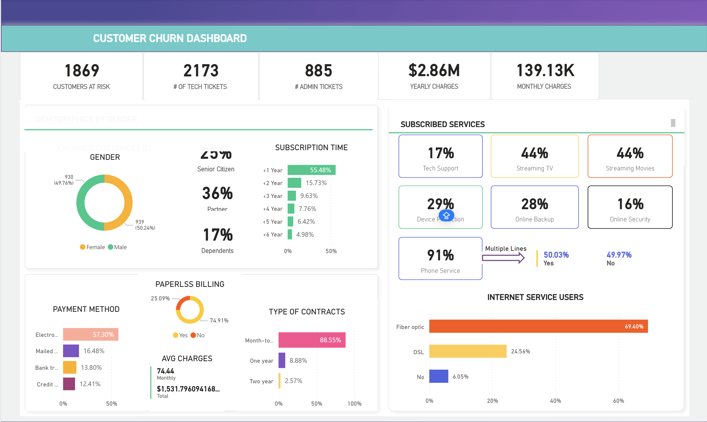

## Customer Churn Analysis Dashboard

---

### Business Problem
This dashboard was developed to identify at-risk customers and understand the underlying drivers of churn in a subscription-based service (likely Telecom). The goal is to provide the retention team with actionable data regarding service usage, contract types, and support ticket frequency to proactively reduce customer turnover.

### Dataset Explanation
https://www.kaggle.com/datasets/royjafari/customer-churn

The dataset contains customer profile information and service interaction history:
* **Risk Profile:** Identification of "At Risk" customers and ticket volumes (Tech vs. Admin).
* **Account Info:** Subscription tenure, contract type (Month-to-Month vs. Yearly), and billing preferences.
* **Services:** Subscriptions to Internet (Fiber/DSL) and add-ons (Streaming, Backup, Security).
* **Demographics:** Senior citizen status, partners, and dependents.

### Key KPIs
* **Customers At Risk:** 1,869
* **Tech Tickets:** 2,173
* **Admin Tickets:** 885
* **Yearly Charges:** $2.86M
* **Monthly Charges:** 139.13K

### Insights
* **The "First Year" Danger Zone:** Over **55%** of churned or at-risk customers have a subscription time of **less than 1 year**.
* **Contract Volatility:** A massive **88.55%** of at-risk customers are on **Month-to-month contracts**, indicating very low long-term commitment.
* **Technical Friction:** The high volume of **Tech Tickets (2,173)** compared to Admin tickets suggests that service reliability or setup issues are major drivers of dissatisfaction.
* **Service Correlation:** Customers using **Fiber Optic (69.4%)** represent the largest share of internet users, while low-adoption services like **Online Security (16%)** and **Tech Support (17%)** correlate with higher risk.
* **Billing Patterns:** **Electronic Checks** are the most common payment method among this group, and **Paperless Billing** is highly adopted (74.9%).

### Business Recommendations
* **Early Intervention Program:** Implement a "New Customer Success" program targeting subscribers in their **first 12 months** to improve the 55% churn rate in that segment.
* **Contract Conversion Incentives:** Offer discounts or value-added services (like free Streaming TV) to move **Month-to-month** customers onto 1-year or 2-year contracts.
* **Technical Support Overhaul:** Investigate the root causes behind the high **Tech Ticket** volume. Solving these recurring technical issues could drastically reduce the "At Risk" pool.
* **Upsell Security & Support:** Since adoption for **Online Security** and **Tech Support** is low, bundling these services for free for "At Risk" customers may increase their perceived value and stickiness to the brand.
