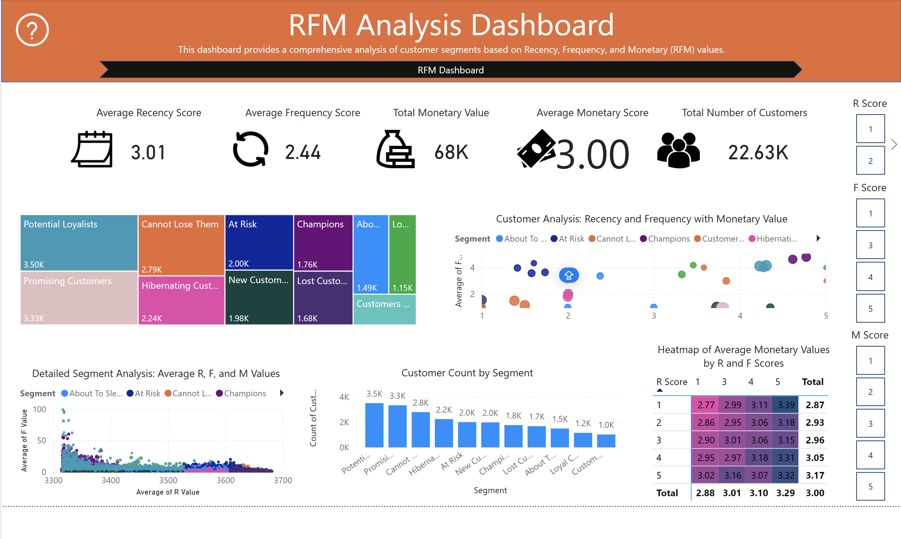

## RFM Analysis Dashboard

---

### Business Problem
The business required a data-driven way to segment its 22.63K customers based on their value and behavior. By using **Recency, Frequency, and Monetary (RFM)** modeling, the goal was to distinguish "Champions" from "At Risk" or "Hibernating" customers to personalize marketing strategies.

### Dataset Explanation
https://www.kaggle.com/datasets/marian447/retail-store-sales-transactions

The dashboard uses behavioral scoring based on:
* **Recency (R):** How recently a customer made a purchase.
* **Frequency (F):** How often a customer purchases.
* **Monetary (M):** The total value of the purchases.
* **Segments:** 10+ distinct groups including Potential Loyalists, Champions, and Lost Customers.

### Key KPIs
* **Total Number of Customers:** 22.63K
* **Total Monetary Value:** 68K
* **Average Recency Score:** 3.01
* **Average Frequency Score:** 2.44
* **Average Monetary Score:** 3.00

### Insights
* **Segment Distribution:** **Potential Loyalists (3.50K)** and **Promising Customers (3.33K)** are the largest segments, representing a significant opportunity for growth.
* **High-Value Elite:** The **Champions (1.76K)** segment has the highest average R, F, and M scores, making them the most valuable core of the business.
* **At-Risk Volume:** There are **2.00K** customers classified as "At Risk" and **2.24K** "Hibernating," indicating a large portion of the base is disengaging.
* **Value Heatmap:** The highest average monetary values (3.39) are found in the **R Score 5 / F Score 5** bracket, confirming that recent, frequent shoppers spend the most.

### Business Recommendations
* **Nurture Potential Loyalists:** Implement an automated "Next Best Offer" campaign for **Potential Loyalists** to increase their frequency score and move them into the Champion segment.
* **Win-Back Strategy:** Launch a re-engagement campaign (e.g., "We Miss You" discounts) specifically for the **At Risk** and **Cannot Lose Them** segments.
* **Reward Champions:** Create an exclusive **VIP/Loyalty program** for Champions to maintain their high recency and frequency levels.
* **Optimize Spend:** Reduce marketing spend on **Lost Customers (1.68K)** and instead reallocate those funds toward the **Promising** segment to maximize ROI.
