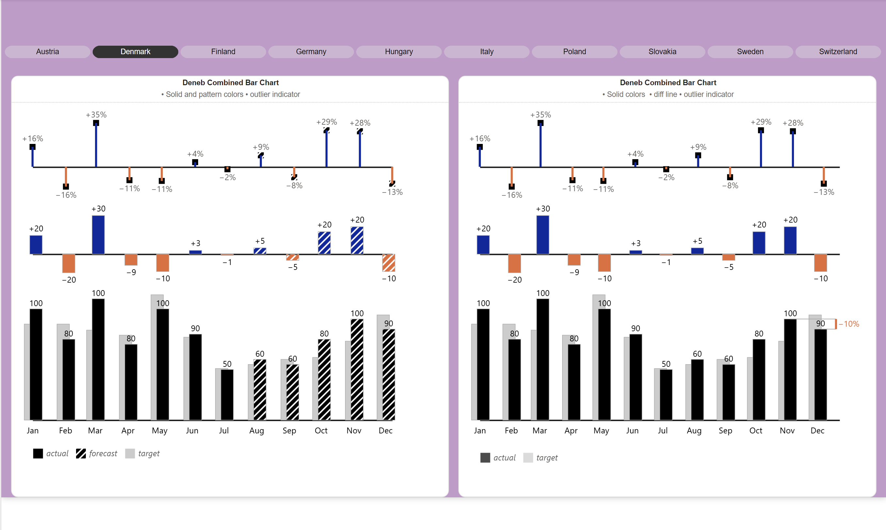

## Regional Performance Variance Analysis

---

### Business Problem
The goal of this project was to provide a highly customized visualization to compare monthly performance against targets and forecasts across multiple European regions. The business needed a way to instantly identify outliers, variance percentages, and monthly trajectories (Actual vs. Target) that standard Power BI visuals could not effectively communicate.

### Dataset Explanation
https://github.com/aliahmad-1987/SalesAnalysis/blob/main/ActualSalesVsTarget/actual_vs_target_sales_dataset.csv

The dashboard utilizes regional sales and target data for several European countries (Austria, Denmark, Finland, etc.). Key components include:
* **Monthly Metrics:** Actual performance values vs. predefined Target and Forecast figures.
* **Variance Data:** Percentage growth/decline and absolute numerical differences.
* **Geographic Filters:** Multi-country selection (e.g., Denmark, Germany, Italy) to compare regional efficiency.

### Key KPIs
* **Monthly Targets:** Ranging from 50 to 100 units/value per month.
* **Variance Percentage:** Fluctuations between -16% (Feb) and +35% (Mar).
* **Outlier Indicators:** Automated visual cues for significant performance deviations.

### Insights
* **Peak Performance:** March represents the strongest month for the selected region (Denmark), exceeding targets by **+35%** (+30 units).
* **Underperformance Trends:** February and May show the most significant dips, falling **-16%** and **-11%** below target respectively.
* **Forecast Accuracy:** The final quarter (Oct-Dec) demonstrates high forecast reliance, with November showing a strong **+29%** positive variance.
* **Consistency Gaps:** While certain months like June (+4%) and August (+9%) show marginal gains, the overall year is characterized by high volatility rather than steady growth.

### Business Recommendations
* **Identify Q1 Drivers:** Investigate the specific factors (marketing, seasonality, or supply chain) that led to the **+35% surge in March** to replicate that success in underperforming months.
* **Mitigate Recurring Dips:** Analyze the causes for the target misses in February and April/May to determine if targets are set too high or if there are external regional hurdles.
* **Standardize Reporting:** Use this **Deneb-based visual** across all European branches to ensure a unified "Actual vs. Target" language, making it easier for executive leadership to spot regional outliers at a glance.
* **Q4 Strategic Alignment:** Since the year ends on a positive trajectory in Q4, leverage the momentum from the November peak (+29%) to set more aggressive yet attainable targets for the following Q1.
