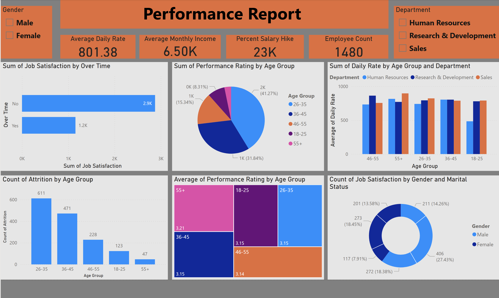

## Performance & Employee Attrition Report

---

### Business Problem
The goal of this project was to analyze workforce dynamics to understand the factors driving employee performance and attrition. The department needed a clear view of how age, department, and work-life balance (overtime) impact job satisfaction and retention to develop targeted internal policies for employee engagement.

### Dataset Explanation
https://www.kaggle.com/datasets/shedai/sales-person-performance

The dashboard processes human resources data for a workforce of 1,480 employees. Key data features include:
* **Compensation & Growth:** Daily rates, monthly income, and percentage salary hikes.
* **Performance Metrics:** Ratings segmented by age groups (18–55+).
* **Sentiment Analysis:** Job satisfaction levels correlated with overtime work and marital status.
* **Attrition Data:** Historical counts of employees leaving the organization, broken down by age.
* **Demographics:** Gender, age brackets, and departmental alignment (HR, R&D, Sales).

### Key KPIs
* **Employee Count:** 1,480
* **Average Monthly Income:** 6.50K
* **Average Daily Rate:** 801.38
* **Percent Salary Hike:** 23K (Total aggregate)

### Insights
* **The "Prime" Attrition Age:** Attrition is highest in the **26-35 age group (611)**, followed by the 36-45 group, suggesting that mid-career professionals are the most likely to leave.
* **Overtime vs. Satisfaction:** Employees who do **not** work overtime report significantly higher total job satisfaction (2.9K) compared to those who do work overtime (1.2K).
* **Performance Consistency:** Performance ratings are remarkably consistent across age groups, with the **55+ group** leading slightly with an average rating of **3.21**, while most other groups sit at a steady **3.14 - 3.15**.
* **Demographic Satisfaction:** Single males and married males represent the largest segments of the "Job Satisfaction" count, while female employees show a more balanced distribution across marital statuses.
* **Daily Rate Disparity:** The **Sales** and **R&D** departments maintain higher average daily rates across most age groups compared to Human Resources, particularly in the 18-25 bracket.

### Business Recommendations
* **Retention Focus on 26-35s:** Develop a "Mid-Career Retention Program" specifically for the **26-35 age bracket**, focusing on clear career pathing and internal growth opportunities to curb high attrition.
* **Overtime Management:** Review the distribution of workloads. Reducing mandatory overtime could be the most direct lever to increase overall organizational job satisfaction.
* **R&D and Sales Benchmarking:** Use the compensation and daily rate structures from the **Research & Development** department as a benchmark for other departments to ensure competitive pay across the organization.
* **Performance Recognition:** Since the **55+ age group** shows the highest average performance rating, implement a mentorship program where these senior employees can train younger cohorts (18-25), fostering knowledge transfer and engagement.
