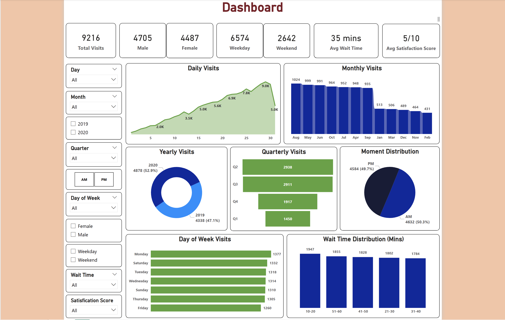

## Patient Visit Analytics Dashboard

---

### Business Problem
The primary objective of this dashboard was to analyze clinic operational efficiency and patient flow. The facility needed to understand peak visitation times, average wait periods, and satisfaction levels to optimize staffing schedules and improve the overall patient experience.

### Dataset Explanation
https://www.kaggle.com/datasets/prasad22/healthcare-dataset

The dashboard utilizes clinic operational data spanning across 2019 and 2020. Key data dimensions include:
* **Temporal Data:** Monthly, quarterly, daily, and hourly (AM/PM) visit timestamps.
* **Patient Demographics:** Gender distribution (Male/Female).
* **Operational Metrics:** Wait times (in minutes) and patient satisfaction scores (out of 10).
* **Day Type:** Categorization of visits into Weekdays vs. Weekends.

### Key KPIs
* **Total Visits:** 9,216
* **Avg. Wait Time:** 35 mins
* **Avg. Satisfaction Score:** 5/10
* **Gender Split:** 4,705 Male / 4,487 Female
* **Visit Volume:** 6,574 Weekday / 2,642 Weekend

### Insights
* **Peak Visitation:** Daily visits show a steady climb throughout the month, peaking significantly around the **30th** (9.0K visits) before dropping.
* **Monthly Declines:** There is a sharp downward trend in monthly visits starting after September, reaching its lowest point in **February**.
* **Wait Time Distribution:** The highest volume of patients (1,947) experience wait times between **10-20 minutes**, but a significant portion of the population waits over 40 minutes, contributing to the average.
* **Satisfaction Plateau:** An average satisfaction score of **5/10** indicates a neutral-to-poor patient experience, likely correlated with wait times or specific low-performance months.
* **Visit Timing:** Patient volume is almost perfectly split between **AM (50.3%)** and **PM (49.7%)**, suggesting a consistent load throughout the day.

### Business Recommendations
* **Improve Satisfaction Scores:** Conduct qualitative surveys for patients reporting below a 5/10 to identify if the issue is clinical, administrative, or facility-related.
* **Staffing Optimization:** Since **Mondays** show the highest visit volume (1,377), ensure maximum administrative and clinical staffing on that day to reduce wait times.
* **Off-Peak Marketing:** Investigate the cause of the drastic dip in visits during **February** and consider seasonal health promotions to stabilize clinic revenue during slow months.
* **Wait Time Management:** With nearly 2,000 patients waiting between 10-20 minutes, explore "digital check-ins" or "live queue tracking" to better manage patient expectations and improve the perceived wait experience.
