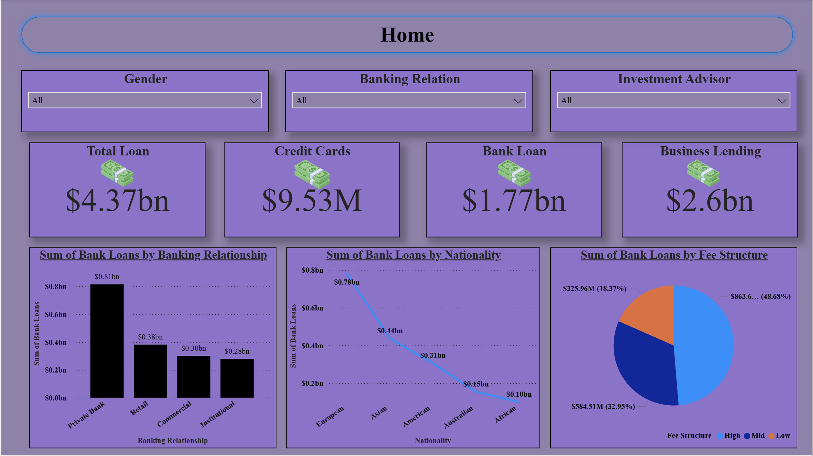

## Banking Loan Portfolio Dashboard

---

### Business Problem
The objective of this project was to analyze the bank’s lending portfolio to understand the distribution of risk and capital. The institution needed to identify which banking relationships (Private vs. Retail) drive the highest loan volume, how lending varies by global nationality, and the impact of different fee structures on the total loan value.

### Dataset Explanation
https://www.kaggle.com/datasets/kidoen/bank-customers-data

The dashboard summarizes global banking transactions and lending profiles. Key data points include:
* **Loan Products:** Total loans, credit card debt, bank loans, and business lending figures.
* **Customer Segmentation:** Segmentation by gender, banking relationship (Private, Retail, Commercial, Institutional), and investment advisor.
* **Geographics:** Loan distribution categorized by nationality (European, Asian, American, Australian, African).
* **Financial Terms:** Fee structures categorized as High, Mid, and Low.

### Key KPIs
* **Total Loan Volume:** $4.37bn
* **Total Bank Loans:** $1.77bn
* **Business Lending:** $2.6bn
* **Credit Card Debt:** $9.53M

### Insights
* **Primary Lending Driver:** **Private Banking** is the most significant relationship segment, accounting for **$0.81bn** in bank loans, nearly double the volume of the Retail segment.
* **Geographic Concentration:** **European** customers hold the highest concentration of bank loans ($0.78bn), followed by Asian customers ($0.44bn), while the African market represents the smallest footprint ($0.10bn).
* **Fee Structure Distribution:** Nearly half of the portfolio (**48.68%**) is under a **High fee structure**, contributing significantly to bank revenue, while the Low fee structure accounts for only 18.37%.
* **Product Mix:** Business lending ($2.6bn) is a much larger part of the portfolio than individual bank loans ($1.77bn), suggesting a heavy corporate/commercial focus.

### Business Recommendations
* **Private Banking Retention:** Since **Private Banking** is the core of the lending portfolio, implement premium loyalty benefits for these clients to prevent churn to competitors.
* **Market Expansion:** Investigate the low lending volume in the **American and Australian** markets ($0.31bn and $0.15bn respectively) to determine if there are regulatory hurdles or opportunities for market share growth.
* **Fee Strategy Optimization:** Evaluate if the **18.37%** of "Low" fee loans can be transitioned to "Mid" tier structures through value-added services to increase net interest margin.
* **Credit Card Growth:** Compared to billions in loans, the **$9.53M in Credit Card debt** is relatively low; consider cross-selling credit card products to existing Business and Private Banking clients to diversify interest income.
