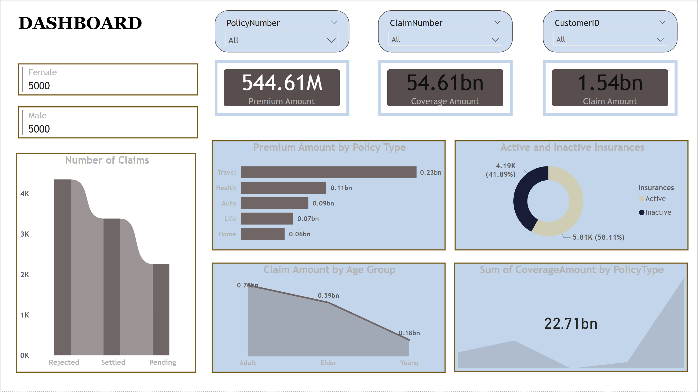

## Insurance Claims & Policy Analysis Dashboard

---

### Business Problem
The objective of this project was to provide a comprehensive overview of an insurance portfolio's health, focusing on claim processing efficiency and policy distribution. The business needed to identify which policy types generate the highest premiums, understand the financial exposure across different age groups, and monitor the ratio of active versus inactive insurance policies.

### Dataset Explanation
https://www.kaggle.com/datasets/litvinenko630/insurance-claims

The dashboard analyzes insurance policy and claims data. Key data components include:
* **Financial Metrics:** Premium amounts, coverage amounts, and total claim amounts.
* **Policy Details:** Policy types (Travel, Health, Auto, Life, Home) and status (Active vs. Inactive).
* **Claims Status:** Categorization of claims as Rejected, Settled, or Pending.
* **Demographics:** Customer age groups (Young, Adult, Elder) and gender distribution.

### Key KPIs
* **Total Premium Amount:** 544.61M
* **Total Coverage Amount:** 54.61bn
* **Total Claim Amount:** 1.54bn
* **Policy Count:** 10,000 (Split 50/50 between Male and Female)

### Insights
* **Primary Premium Source:** **Travel insurance** is the dominant policy type by premium volume, generating **0.23bn**, followed by Health insurance.
* **Claims Processing Trends:** The number of **Rejected claims** is the highest category, followed by Settled claims, with Pending claims being the lowest, suggesting a rigorous but potentially high-friction verification process.
* **Age-Based Exposure:** The **Adult** age group accounts for the highest claim amount (**0.78bn**), with a significant downward trend in claim volume as the demographic shifts to Elders and then the Young.
* **Policy Retention:** Over **58%** of the insurance policies are currently **Inactive**, highlighting a significant challenge in policy renewal or customer retention.
* **Coverage Concentration:** Total coverage for policies reaches a peak of **22.71bn** for specific policy types, indicating high financial liability in certain sectors of the portfolio.

### Business Recommendations
* **Retention Campaign:** Launch a targeted re-engagement campaign for the **58.11% inactive policyholders** to understand why they have not renewed and offer incentives for reactivation.
* **Travel Policy Optimization:** Since **Travel insurance** drives the most premium revenue, consider introducing "Premium Travel" tiers with enhanced coverage to further increase the average premium per user.
* **Claims Friction Audit:** Investigate the high volume of **Rejected claims**. If these are due to simple filing errors, improving the user interface for claim submissions could reduce administrative overhead and improve customer satisfaction.
* **Adult Segment Risk Management:** Since the **Adult** demographic has the highest claim payouts, review the underwriting criteria for this group to ensure that premiums are adequately priced against the risk of high-value claims.
